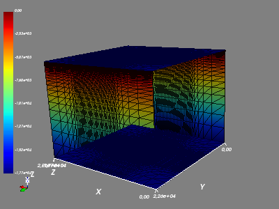

# RifLab Geophysical Framework (RGF)

## About Us
RifLab Geophysical Framework (RGF) is a Python framework for geophysical applications..

author: arif.darmawan@riflab.com

## Screenshot

Using mayavi

Using matplotlib

## Whats Next:
1. Make every single cell have different value
